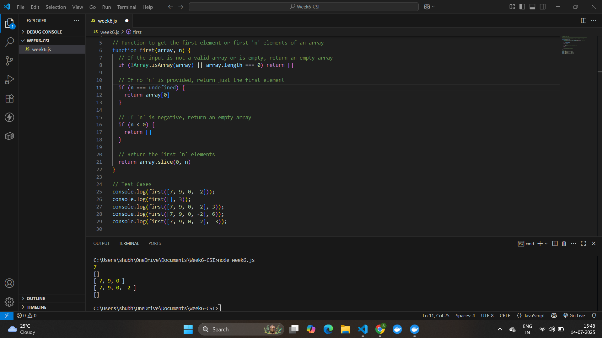

#  CSI Internship Week 6 Assignment

##  Task  
Write a JavaScript function to get the **first element** of an array.  
If a parameter `n` is passed, return the **first `n` elements** of the array.

---

##  Files Included
- `week6.js` – Contains the JavaScript code embedded in a browser-executable format.

---

## 📸 Screenshot

Below is the screenshot of the output in the browser console:




##  Function Logic

```javascript
function first(array, n) {
  if (!Array.isArray(array) || array.length === 0) return [];

  if (n === undefined) {
    return array[0];
  }

  if (n < 0) {
    return [];
  }

  return array.slice(0, n);
}

## Test Data
console.log(first([7, 9, 0, -2]));       // ➤ 7
console.log(first([], 3));              // ➤ []
console.log(first([7, 9, 0, -2], 3));    // ➤ [7, 9, 0]
console.log(first([7, 9, 0, -2], 6));    // ➤ [7, 9, 0, -2]
console.log(first([7, 9, 0, -2], -3));   // ➤ [] ```


